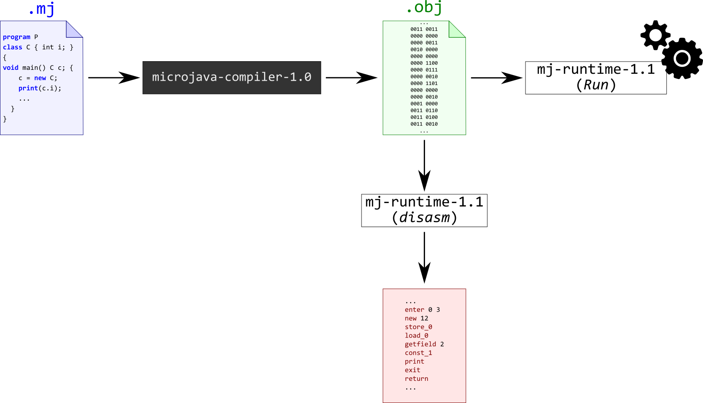

# MicroJava Compiler


[](https://www.codefactor.io/repository/github/danijelaskov/microjava-compiler)

## Introduction

**MicroJava** is a *high-level programming language*.
As the name suggests, **MicroJava** is *similar* to **Java** (which you are, probably, already familiar with), but it's *simpler*.
Similarly to Java, MicroJava source files are compiled to **bytecode**, which is then executed by a **virtual machine** (it's called (as you might have guessed) **MicroJava Virtual Machine**). MicroJava VM is a simple *interpretative emulator* (i.e. it does not have any support for some "fancy" techniques such as, e.g., *Just-In-Time compilation*).



Full project specification can be found [here](https://1drv.ms/b/s!AuZ7wmWsDfythjkXnkK3T5gJ7NIy) and [here](https://1drv.ms/b/s!AuZ7wmWsDfythjgxu8VErKo9wBa7) (Serbian language only).
Note that I have used custom directory structure (not the one defined in the specification).

## Main language features

* A MicoJava program is a single text file (conventionally, the extension `.mj` is used).
  It always starts with the keyword `program`.
* The main method of a MicroJava program is always called `main`.
  When MicroJava program is executed, this method is called first (i.e. it's the program's entry point).
* There are:
  * Value/primitive types (`int`, `char` and `bool`) and reference/structured types (one-dimensional arrays and user-defined classes)
  * Integer, character and boolean constants
  * Global, local and class variables (i.e. fields)
  * Global (static) and class functions (i.e. methods).
    There are no constructors
* Every class can inherit from some other class, except from itself.
  MicroJava is a single‐inheritance language.
* Inheritance in MicroJava has the *same* principles as in Java.
  Object is an instance of its class and, at the same time, all superclasses of its class.
  The subclass reference can be assigned to any of its superclass references.
  The act of converting a subclass reference into a superclass reference is called up-casting.
* Superclass methods can be **overridden** in its subclass.
  Because of that, method binding occurs at run-time, based on the type of the object.
  This is **polymorphism** (also called dynamic binding or late binding or run‐time binding) and it is a key principle of OOP.
* Within a method, the name of a field refers to the current object's field, assuming that the field isn't hidden by a method parameter.
  If it is hidden, we can access it through `this.<field-name>`.
  In the body of a method, `this` represents reference to the object whose method has been invoked.
* Method overloading is not supported in MicroJava.
* There is no `Object` class, the top‐most class, the class from which all other classes are implicitly derived.
* There is no garbage collector (allocated objects are only deallocated when the program ends).
* Predeclared static methods are `ord` (converts `char` to `int`), `chr` (converts `int` to `char`) and `len` (returns array's length).

## Syntax specification

```
  Program = "program" ident {ConstDecl | VarDecl | ClassDecl} "{" {MethodDecl} "}".
  ConstDecl = "const" Type ident "=" (numConst | charConst | boolConst) {, ident "=" (numConst | charConst | boolConst)} ";".
  VarDecl = Type ident ["[" "]"] {"," ident ["[" "]"]} ";".
  ClassDecl = "class" ident ["extends" Type] "{"{VarDecl} ["{" {MethodDecl} "}"] "}".
  MethodDecl = (Type | "void") ident "(" [FormPars] ")" {VarDecl} "{" {Statement} "}".
  FormPars = Type ident ["[" "]"] {"," Type ident ["[" "]"]}.
  Type = ident.
  Statement = DesignatorStatement ";"
            | "if" "(" Condition ")" Statement ["else" Statement]
            | "do" Statement "while" "(" Condition ")" ";"
            | "break" ";"
            | "continue" ";"
            | "return" [Expr] ";"
            | "read" "(" Designator ")" ";"
            | "print" "(" Expr ["," numConst] ")" ";"
            | "{" {Statement} "}".
  DesignatorStatement = Designator ("=" Expr | "(" [ActPars] ")" | "++" | "‐‐")
  ActPars = Expr {"," Expr}.
  Condition = CondTerm {"||" CondTerm}.
  CondTerm = CondFact {"&&" CondFact}.
  CondFact = Expr [Relop Expr].
  Expr = ["‐"] Term {Addop Term}.
  Term = Factor {Mulop Factor}.
  Factor = Designator ["(" [ActPars] ")"]
         | numConst
         | charConst
         | boolConst
         | "new" Type ["[" Expr "]"]
         | "(" Expr ")".
  Designator = ident {"." ident | "[" Expr "]"}.
  Relop = "==" | "!=" | ">" | ">=" | "<" | "<=".
  Addop = "+" | "‐".
  Mulop = "*" | "/" | "%".
```

`ident` is a non-empty sequence of alphanumeric characters and `_`, starting with letter.
`numConst` is a sequence of one or more decimal digits.
`charConst` is a sequence starting with `'` followed by a single printable character and ending with `'`.
`boolConst` is either `true` or `false`.

MicroJava's single line comment starts with two forward slashes with no white spaces (`//`) and lasts till the end of line.

## Building and testing the project

This project uses [Gradle 7.3](https://docs.gradle.org/current/userguide/userguide.html) and [Java 17](https://adoptium.net/temurin/) (the latest LTS release as of February 2023).
Open command-line interpreter and type one of the following commands:

* `gradlew genLexer` (Windows) or `./gradlew genLexer` (macOS and Linux), to generate lexer (tokenizer) implementation ([`MJLexer.java`](src/main/java/askov/schoolprojects/compilerconstruction/mjcompiler/MJLexer.java)) based on [lexer specification](src/main/spec/mjlexer.flex).
* `gradlew genParser` (Windows) or `./gradlew genParser` (macOS and Linux), to generate parser implementation ([`MJParser.java`](src/main/java/askov/schoolprojects/compilerconstruction/mjcompiler/MJParser.java), [`sym.java`](src/main/java/askov/schoolprojects/compilerconstruction/mjcompiler/sym.java)) and abstract syntax tree implementation (classes inside [`ast`](src/main/java/askov/schoolprojects/compilerconstruction/mjcompiler/ast) directory), based on [parser specification](src/main/spec/mjparser.cup).
* `gradlew build` (Windows) or `./gradlew build` (macOS and Linux), to build the project, test the compiler and run MicroJava VM. MicroJava Compiler will compile the test file [`simple_calculator.mj`](src/test/resources/simple_calculator.mj) and produce `simple_calculator.obj`. Then, the machine code inside `simple_calculator.obj` will be executed by MicroJava VM.
Note that, for testing purposes, standard input has been substituted with a file named [`input_stream.txt`](src/test/resources/input_stream.txt).
* `gradlew disassemble` (Windows) or `./gradlew disassemble` (macOS and Linux), to disassemble `simple_calculator.obj` produced in the previous step, using [`rs.etf.pp1.mj.runtime.disasm`](libs/mj-runtime-1.1.jar).

You can always run MicroJava Compiler as a standalone application.
In order to achieve this, you just have to type `gradlew run <source-file-name> <obj-file-name>` (Windows) or `./gradlew run <source-file-name> <obj-file-name>` (macOS and Linux).

## Note to the reader of this README

If you have any question, suggestion or collaboration offer, please feel free to [contact me](mailto:danijel.askov@gmail.com).
**If you find this repository useful, please consider starring it!**
